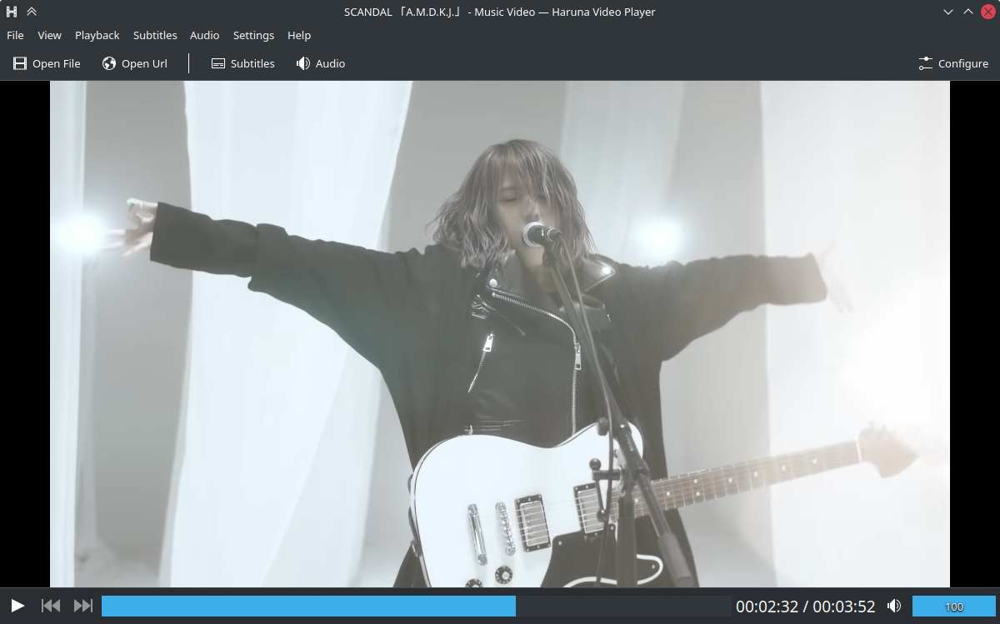

<!--
SPDX-FileCopyrightText: 2020 George Florea Bănuș <georgefb899@gmail.com>

SPDX-License-Identifier: CC-BY-4.0
-->

### [Read before reporting a bug or requesting a feature](./bugs_and_feature_requests.md)

----

#### Donate: [GitHub Sponsors](https://github.com/sponsors/g-fb) | [Liberapay](https://liberapay.com/gfb/) | [PayPal](https://paypal.me/georgefloreabanus)

# Haruna

Haruna is an open source media player built with Qt/QML and libmpv.


For more screnshots go to [Haruna's website](https://haruna.kde.org)

# Install

https://flathub.org/apps/details/org.kde.haruna

```
flatpak install flathub org.kde.haruna
flatpak run org.kde.haruna
```

[Flatpak setup guide](https://flatpak.org/setup/)

# Features

these are just some features that set Haruna apart from others players

- video preview on seek/progress bar

- play online videos, through youtube-dl

- toggle playlist with mouse-over, playlist overlays the video

- auto skip chapter containing certain words

- configurable shortcuts and mouse buttons

- quick jump to next chapter by middle click on progress bar

- custom mpv commands, can be run at start up or on keyboard shortcut

# Dependencies
Dependencies will be printed by `cmake` when building.

# Build

```bash
git clone https://invent.kde.org/multimedia/haruna.git
cd haruna
cmake -B build -G Ninja
cmake --build build
cmake --install build
```
